Homework #8
Docker
1. Link to docker file: https://github.com/solislaura/spring-petclinic/blob/8130798da282dbda72f255faff41cd7c4ea433ce/Dockerfile

2. Your running docker instance as shown by a ps command
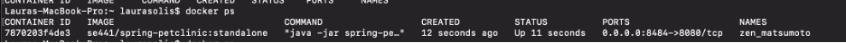

3. Your browser accessing the main page of the website from your local container
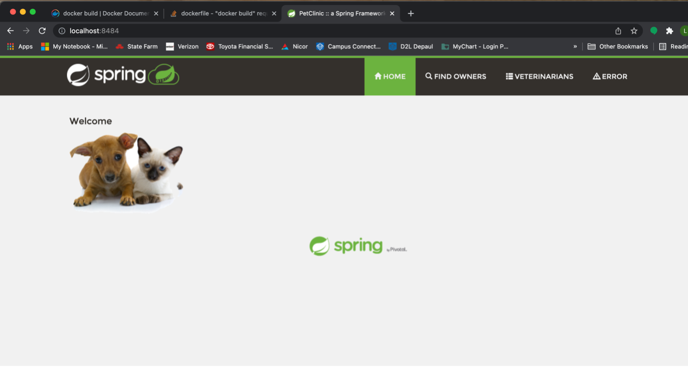

Docker Compose - MySQL Only
4. The output from docker-compose up command
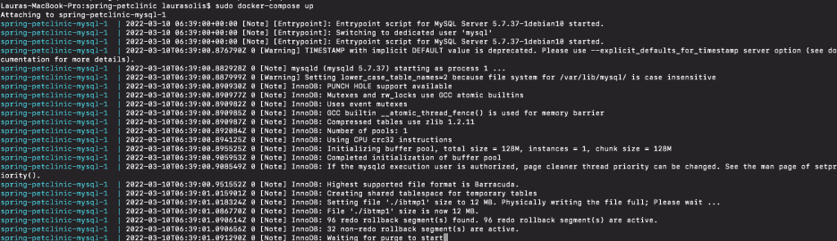

5. Your browser access the "Veterinarians" page of the website from your local container when you run the application from the host system.
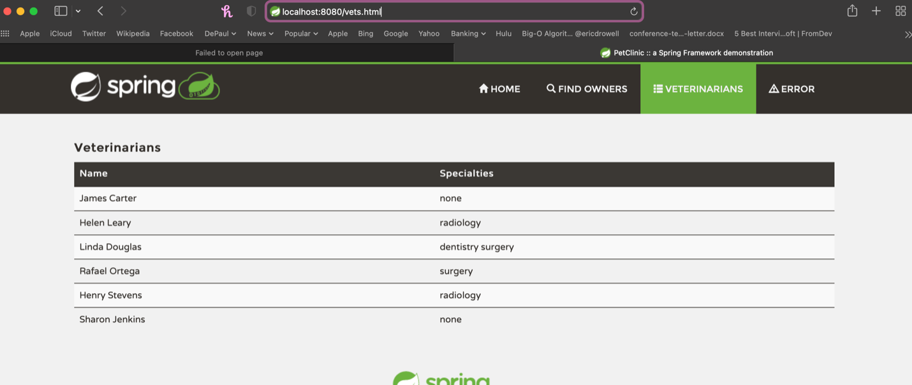

6. A section of the stack trace....
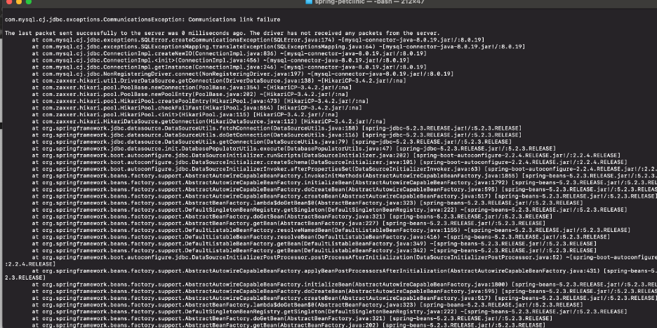

Docker Comose - App Server and MySQL
7. Link to docker-compose.yml file
https://github.com/solislaura/spring-petclinic/blob/8130798da282dbda72f255faff41cd7c4ea433ce/docker-compose.yml

8. Link to the application-mysql.properties file
https://github.com/solislaura/spring-petclinic/blob/8130798da282dbda72f255faff41cd7c4ea433ce/src/main/resources/application-mysql.properties

9. Output from the docker-compose up command
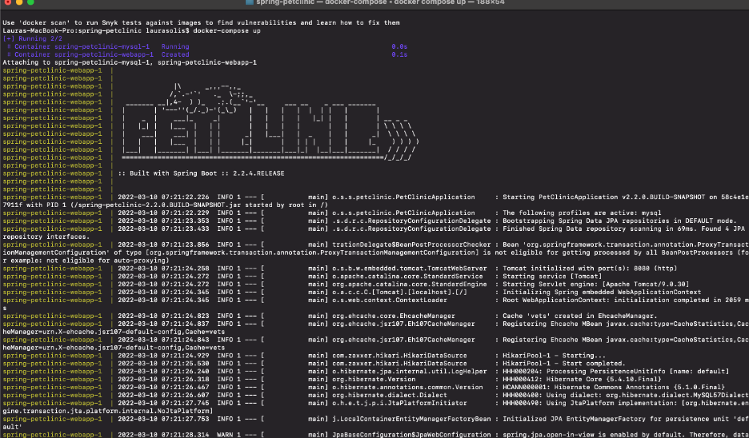

10. Your browser accessing the "Veterinarians" page of the website from your local container
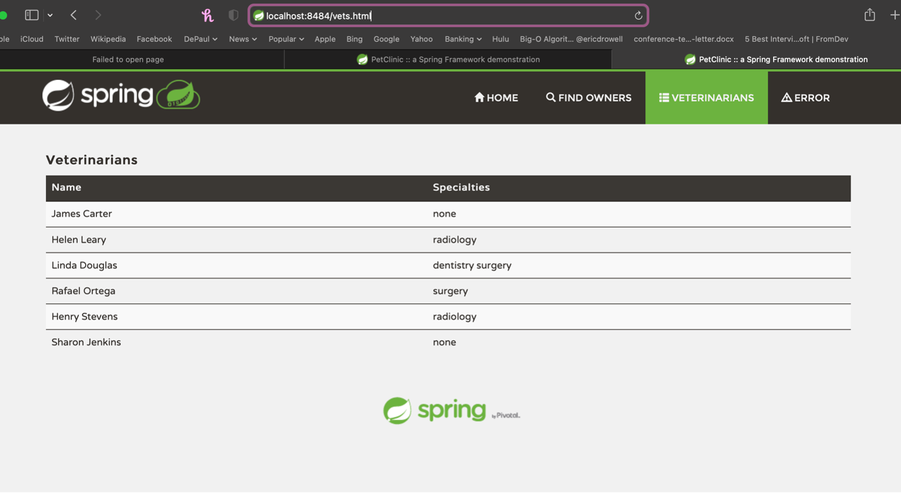

END of HW 8 Assignment

0. Your GitHub account showing that is has been forked from the depaulcdm/spring- petclinic repository. This doesn’t actually need an image – I can see it from your repository.

1. Your GitHub Actions dashboard showing a successful first build.
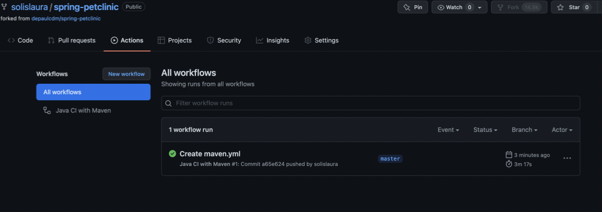

2. Your GitHub repository with the readme.md file selected showing the code that you changed to update the badge.
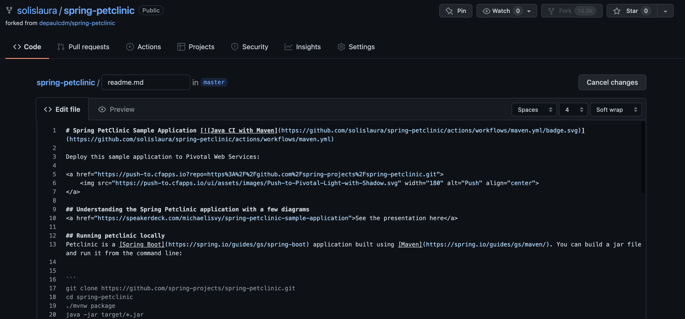

3. Your GitHub repository with the readme.md file selected showing the build success status after you’ve updated the badge markdown.
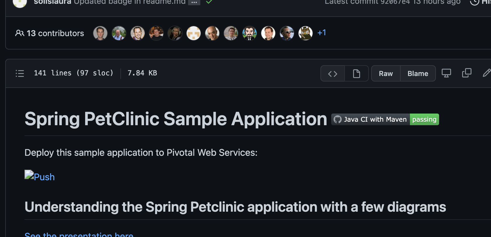

4. The section of the POM file showing the coordinates after you’ve commented them out.
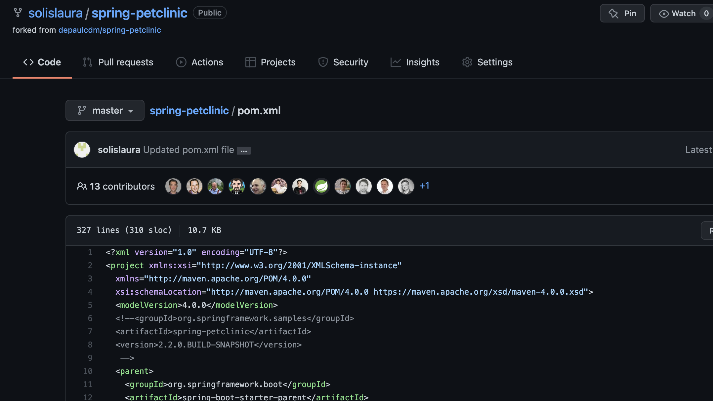

5. Your GitHub Actions dashboard showing the unsuccessful build after the breaking change.
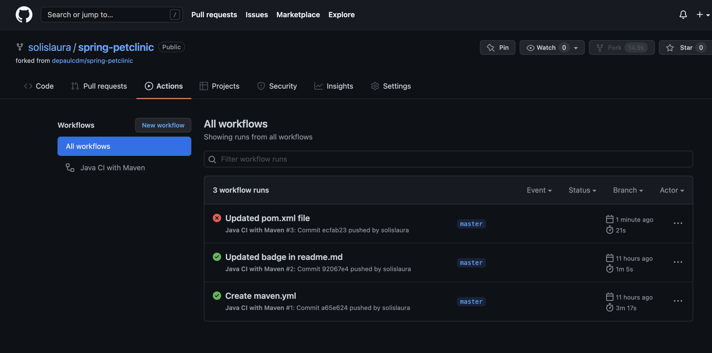

6. Your GitHub repository with the readme.md file selected showing the build failed status after the GitHub workflow fails.
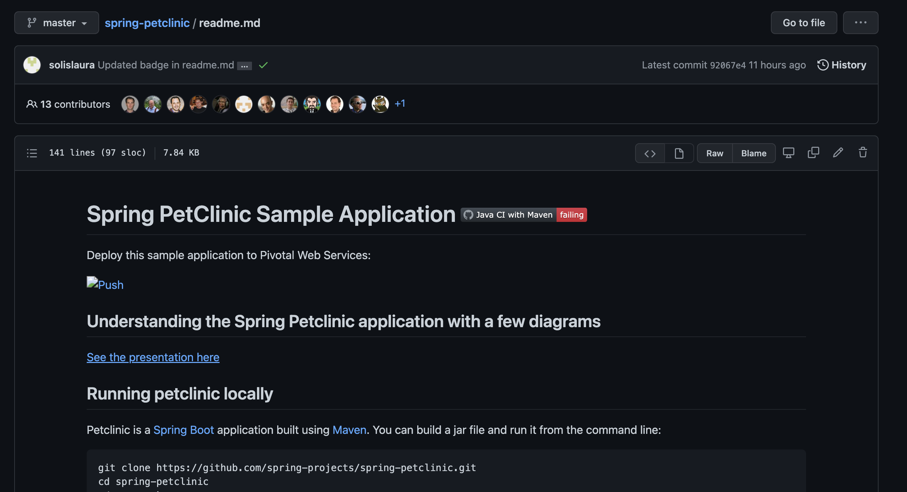

7. The section of the POM file showing the coordinates after you’ve fixed them.
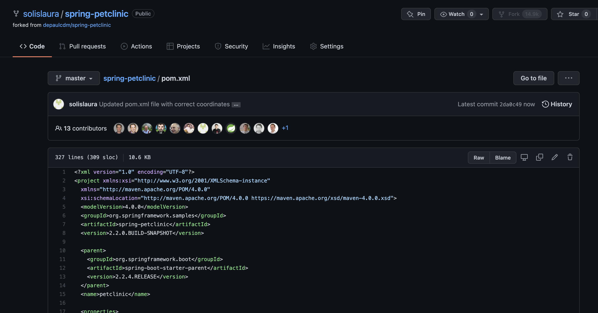

8. Your GitHub Actions dashboard showing the successful build after the breaking change has been fixed.
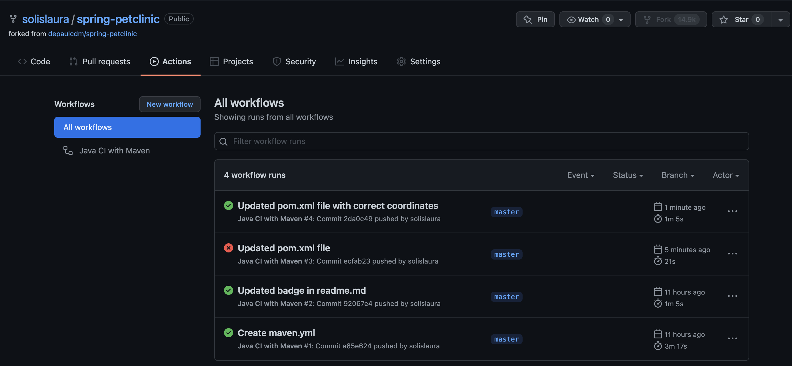

9. Your GitHub repository with the readme.md file selected showing the build success status after the GitHub workflow has recovered.
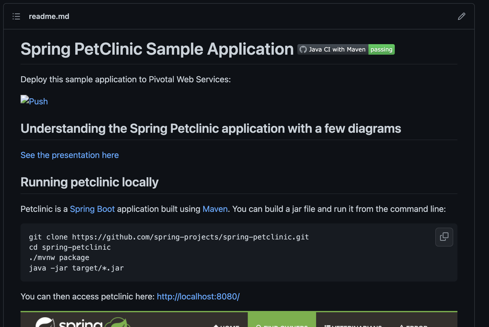
